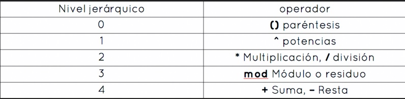
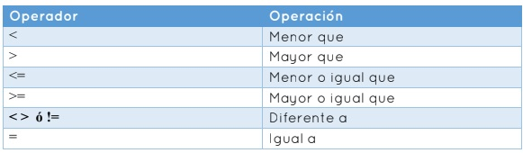
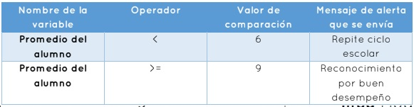

# OPERADORES

## OPERADORES ARITMETICOS

Los operadores aritméticos son los que te permiten realizar operaciones
matemáticas como suma, resta, multiplicación, división, potencias, entre
otras, y se utilizan en algoritmos cuantitativos para encontrar la solución
a un problema.
Al momento de realizar estas operaciones es frecuente agruparlas en uno
o más paréntesis para facilitar su cálculo. Además por medio de este
símbolo se indica que las operaciones deben realizarse de izquierda a
derecha y respetando la prioridad de ejecución de los operadores que es
la siguiente: primero se realiza el cálculo de potencias, después la
multiplicación y división, luego se obtiene el módulo o residuo de una
división, y por último se calcula la suma y resta.

Ejemplo:

X = (3^2 + 10/2) + (3*9)

En la expresión anterior primero se agrupan los términos dentro de los paréntesis de izquierda a derecha

(3^2 + 10/2) primero se realiza lo que hay dentro en este paréntesis

(3*9) después se realiza lo que hay dentro de este otro paréntesis

(3^2 + 10/2) dentro de este paréntesis la potencia 3^2 se realiza primero cuyo resultado es 9.

Después se realiza la división 10/2 cuyo resultado es 5. 

Por último se realiza la suma de las dos operaciones previas que es la suma de 9 + 5 cuyo resultado es 14.

(3*9) dentro de este paréntesis se hace la multiplicación 3*9 cuyo resultado es 27,

Por último se realiza la suma de los resultados de las operaciones dentro de los dos paréntesis.

(3^2 + 10/2) + (3*9) = 14 + 27 = 41.

## OPERADORES RELACIONALES

Los operadores relacionales se utilizan para comparar dos o más valores y determinar si el resultado es falso o verdadero:

Ejemplo. Podríamos diseñar un algoritmo que tomara los datos personales
de un alumno de una escuela y su desempeño académico para
almacenarlos en una base de datos.
Ya almacenados los datos podríamos preguntar por la situación actual de
un alumno para saber si amerita pasar al siguiente nivel. Por ejemplo,
podríamos pedir el promedio general de las calificaciones de todas las
materias que curso en el ciclo anterior. Si el promedio general es menor a
6 se enviaría un mensaje al alumno de alerta donde se le haría saber que
debe tomar una vez más el ciclo anterior inmediato. Si el promedio general
es mayor o igual a 9 podríamos enviar un mensaje de alerta que indique
al alumno que debe pasar por un reconocimiento por parte de la
institución.

## OPERADORES LOGICOS
Los operadores lógicos se utilizan para evaluar dos o más expresiones que
utilizan operadores relacionales para determinar si la expresión en
general es verdadera o falsa. Los operadores lógicos son: conjunción o
AND que se representa con un doble ampersand (&&) y disyunción u OR
que se representa con dos barras (||) verticales. El operador AND
determina el valor booleano de cada expresión, es decir, si ambas son
verdaderas el resultado general de la expresión también lo es, sin
embargo, si una de ellas es falsa el valor final también lo será. El operador
OR evalúa cada expresión, si uno de los términos es verdadero en
automático el valor general de la expresión también lo es. La única forma
en que la expresión pueda ser tomada como falsa es cuando el valor bolea
no de ambos elementos también es falso. El operador negación o NOT que
se representa con el símbolo ¬ , cambia el valor final de una expresión por
su contrario, es decir, si tras evaluar una expresión en general se
determina que es verdadera y se le aplica el operador NOT, entonces el
resultado final será falso.
Los operadores lógicos junto a los relacionales y aritméticos son utilizados
para validar expresiones complejas en los programas y aplicaciones que
usas diariamente. Un ejemplo de ello es la verificación de su identidad
para acceder a tu mail.

