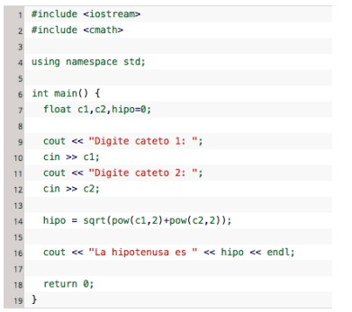
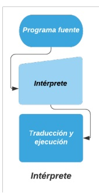
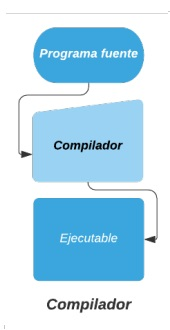

# CONCEPTOS BASICOS DE PROGRAMACION

Cuando realizas una petición a tu equipo de cómputo, (por ejemplo,
guardar un documento en el procesador de textos), internamente se
ejecutan bloques de instrucciones escritos en un lenguaje de
programación que hacen posible las demandas del usuario.
Un lenguaje de programación es un idioma artificial creado para indicarle
a la computadora lo que debe hacer. Tiene ciertas reglas de escritura
(sintaxis) en las que utiliza símbolos y palabras clave, además de una
semántica (interpretación interna).

Un programa es un bloque de instrucciones (código fuente) escritas en
cierto lenguaje de programación cuyo propósito es resolver un problema.

Para ejecutar un programa la computadora realiza una traducción de sus
componentes al lenguaje máquina, es decir, convierte las instrucciones en
cadenas de ceros y unos. Este proceso de conversión puede hacerse de
dos formas:

Por medio de un programa “intérprete” que traduce y ejecuta instrucción
por instrucción.

Los lenguajes interpretados son aquellos lenguajes de programación también de alto nivel en donde el código fuente debe ser traducido a un lenguaje que la máquina entienda y pueda realizar, no crean un archivo externo.

Ejemplos: Python y Ruby

A través de un programa “compilador” que toma al bloque de
instrucciones lo traduce sólo una vez y lo ejecuta.

Los lenguajes compilados son aquellos lenguajes de alto nivel que como su nombre lo sugiere, requieren de un compilador (programa que traduce un lenguaje de alto nivel en código máquina o lenguaje máquina) para traducirlo y crear la parte ejecutable.

Los lenguajes de alto nivel permiten escribir instrucciones en un idioma muy parecido al inglés así como hacer uso de notaciones matemáticas comunes.

Ejemplos: C y C++

